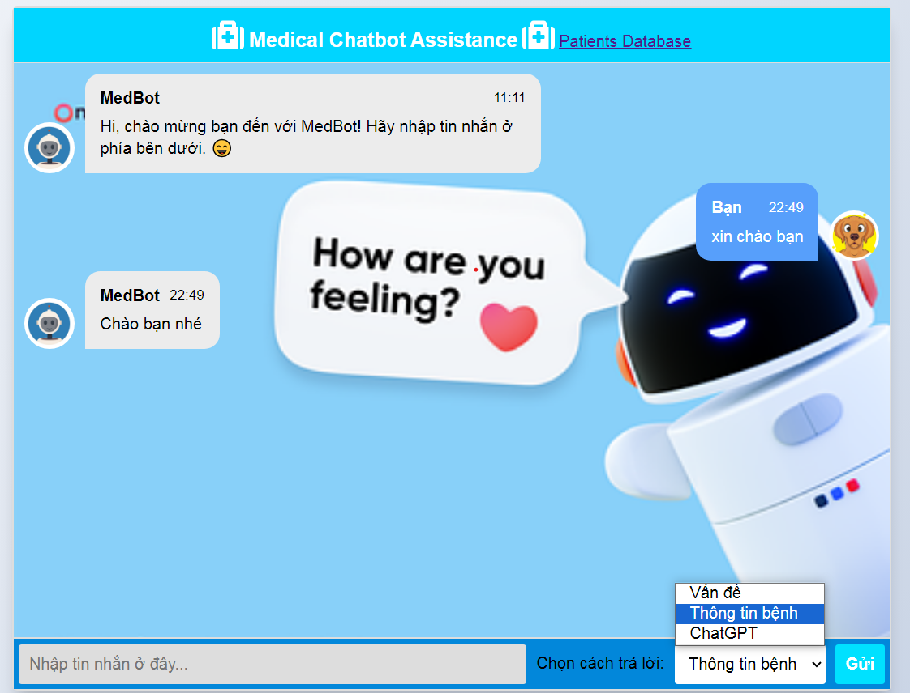

# Vietnamese Medical Chatbot Based
## Overview

The **Vietnamese Medical Chatbot** is a simple yet powerful chatbot designed to assist users with medical-related queries in the Vietnamese language. It leverages natural language processing (NLP) techniques, including **Intent Classification**, **Information Retrieval**, and **ChatGPT**, to respond intelligently to user inquiries. It is just a baic idea that you can develop and deploy the chatbot with other advanced techniques.

## Features

- **Intent Classification:** The chatbot can understand the intent behind user messages, allowing it to provide relevant information or responses.

- **Information Retrieval:** It can retrieve medical information from a knowledge base to answer common medical questions.

- **ChatGPT Integration:** For more complex or open-ended questions, the chatbot can engage in a natural language conversation with users using ChatGPT.

## Getting Started

### Prerequisites

- Python 3.9+
- Java 8+
- [VnCoreNLP](https://github.com/vncorenlp/VnCoreNLP)

### Installation

Create virtual environment with conda
```
conda create -n medbot python=3.9
conda activate medbot
```
Install dependencies:
```
pip install -r requirements.txt
```

### Dataset
For Dataset, you can collect and label as json file similar to /data, for retrieving the answer, database was created using [Pyserini](https://github.com/castorini/pyserini/tree/master)

## API
Run app Flask
```
python app.py
```
The chatbot will be accessible at http://localhost:5000.


You can choose the mode as your desire.



## Docker

Build and Run

```
docker build -t medbot:v1 .
docker run -it -p 5000:5000 medbot:v1
```
